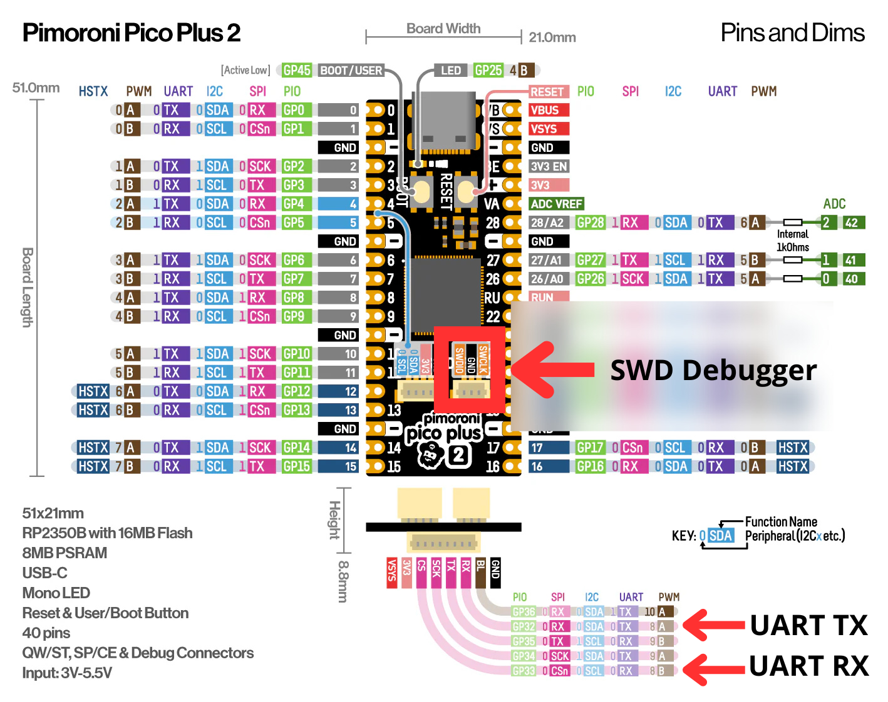

# Yasos.zig (**WIP**)

> [!CAUTION]
> **_work in progress_** - it may contains bugs, unoptimized implementations or stubs instead of real functionalities. 

The Yasos.zig project is general purpose operating system for microcontollers. 
Created in mind to be optimized for resource contrained devices, but with POSIX compatibility and userland which is similar the Linux or Unix operating systems. 

# Supported Boards 

Implementation is ongoing on MSPC v2 board.
MSPCv2 board is RP2350 custom development board. 
Project is maintained inside [MSPCv2](https://github.com/matgla/mspc/tree/mspc_v2)

Pimoroni Pico Plus 2 + Pimoroni VGA board is also supported configuration verified under regression tests.

# Zig version
Zig language is under heavily development, which means frequent changes of standard library and language API.

`main` branch should be compatible with zig version specified in `build.zig.zon -> minimum zig version`.

# How to build
Yasos.zig project requires working `arm-none-eabi-gcc` toolchain for pico-sdk compilation. 
Also `python3` is necessary to use pykconfig lib and to convert elf files into yaff. 

You can use preconfigured docker environment by calling: 
```
make pull_container
make start_env
```

To configure project call: 
```
zig build menuconfig
```

Then select `Board selection` -> `MSPC v2/Pimoroni Pico Plus2` since they are only supported board right now. 

After configuration use:

```
zig build -Doptimize=ReleaseFast
or for debug build:
zig build -Doptimize=Debug
```

To create rootfs image use: 
```
./build_rootfs.sh -c -o rootfs.img
```

# Pimoroni Pico Plus 2 Setup
Connect wiring to UART console and SWD debugger (PicoProbe) as shown on below diagram: 

