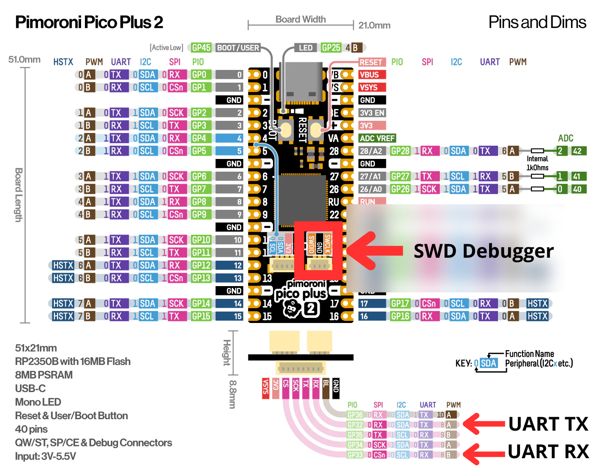

# Yasos.zig (**WIP**)

> [!CAUTION]
> **_work in progress_** - it may contains bugs, unoptimized implementations or stubs instead of real functionalities.

The Yasos.zig project is general purpose operating system for microcontollers.
Created in mind to be optimized for resource contrained devices, but with POSIX compatibility and userland which is similar the Linux or Unix operating systems.

# Supported Boards

Implementation is ongoing on MSPC v2 board.
MSPCv2 board is RP2350 custom development board.
Project is maintained inside [MSPCv2](https://github.com/matgla/mspc/tree/mspc_v2)

Pimoroni Pico Plus 2 + Pimoroni VGA board is also supported configuration verified under regression tests.

# Zig version
Zig language is under heavily development, which means frequent changes of standard library and language API.

`main` branch should be compatible with zig version specified in `build.zig.zon -> minimum zig version`.

# How to build
Yasos.zig project requires working `arm-none-eabi-gcc` toolchain for pico-sdk compilation.
Also `python3` is necessary to use pykconfig lib and to convert elf files into yaff.

You can use preconfigured docker environment by calling:
```
make pull_container
make start_env
```

To configure project call:
```
zig build menuconfig
```

Then select `Board selection` -> `MSPC v2/Pimoroni Pico Plus2` since they are only supported board right now.

After configuration use:

```
zig build -Doptimize=ReleaseFast
or for debug build:
zig build -Doptimize=Debug
```

To create rootfs image use:
```
./build_rootfs.sh -c -o rootfs.img
```

# Flashing
After successful building of kernel and rootfs.img, flash the locally attached board with:
```
scripts/flash.sh                # rootfs.img + kernel
scripts/flash.sh --kernel-only  # kernel only, rootfs left as it is
```
It runs `openocd -f interface/cmsis-dap.cfg -f target/rp2350.cfg` with the program commands, and on failure rescues the debug port and retries at lower adapter speeds; see `scripts/flash.sh --help` for the rest of the options (`--interface`/`--target` pick other configs).

The plain openocd scripts still work too.

Kernel only:
```
openocd -f flash_kernel_rp2350.cfg
```

Kernel and rootfs:
```
openocd -f flash_rp2350.cfg
```

# Pimoroni Pico Plus 2 Setup
Connect wiring to UART console and SWD debugger (PicoProbe) as shown on below diagram:



# Remote smoke runner

If the board is attached to another Linux machine, use [scripts/remote_smoke_tui.py](/home/mateusz/repos/yasos.zig/scripts/remote_smoke_tui.py) to build locally, upload artifacts with `scp`, flash through `ssh`, and run the smoke suite on the remote host.

The script stores its configuration in `.cache/remote_smoke_runner.json`, so once `ssh target`, remote repository path, serial device, and board are filled in, later runs can be started without re-entering them:

```bash
python3 scripts/remote_smoke_tui.py
python3 scripts/remote_smoke_tui.py --run-cached
python3 scripts/remote_smoke_tui.py --run-cached --flash-only
python3 scripts/remote_smoke_tui.py --run-cached --gdb
python3 scripts/remote_smoke_tui.py --run-cached --reset --gdb
python3 scripts/remote_smoke_tui.py --run-cached --debug --gdb
python3 scripts/remote_smoke_tui.py --run-cached --test-retries 2
python3 scripts/remote_smoke_tui.py --run-cached --smoke-tcc-opt-levels -O1 --with-gcc-torture
python3 scripts/remote_smoke_tui.py --run-cached --smoke-tcc-opt-levels -O0 -O2
python3 scripts/remote_smoke_tui.py --run-cached --tests tests/smoke/cd_test.py tests/smoke/ls_test.py
python3 scripts/remote_smoke_tui.py --run-cached --pytest-args 'tests/smoke/tcc_suite_test.py::test_run_tcc_test_suite[00_assignment.c] -x'
python3 scripts/remote_smoke_tui.py --run-cached --full-flash-erase
```

The remote runner also exposes a cached `OpenOCD speed` field. It defaults to `20000` and is passed as `adapter speed` during the remote flash step, so you can tune CMSIS-DAP speed per host/debug probe without editing repo-level `.cfg` files.

The TUI also caches `Test retries`. It defaults to `1` and is passed to pytest as `--reruns`, which helps mask occasional UART noise without rerunning the entire suite manually.

## Run directories

Every run gets its own numbered directory on the remote host — `<remote repo>/workdir/logs/1`, `logs/2`, … with `logs/latest` pointing at the newest — holding that run's serial transcripts, its `failed/` copies and its `tcc_timing_report.json`, plus a `run_info.txt` recording what the run was (kernel/rootfs hashes, opt levels, `--profile`, extra cflags, pytest args, git revision, exit status). Comparing two runs is therefore comparing two directories, which is what an A/B of a kernel or tcc change needs.

It lives under `workdir/` because everything above it is rsynced with `--delete` on every run; a runs root in the repo tree itself is deleted before the run starts, which hands the previous run's number back and overwrites it.

The remote keeps the last `Keep remote run dirs` runs (cached TUI field, default 20; `--keep-runs N`, `0` keeps all). The local mirror under `.cache/remote_smoke_logs/<ssh target>/<N>/` is rsynced during and after every run and is never pruned, so a baseline stays available locally after the remote has rotated it away.

## Optimization levels

The smoke suites — `tests2`, `ir_tests` and GCC torture alike — run once per selected tcc `-O` level, and every runner defaults to the full `-O0 -O1 -O2` matrix: the QEMU gate (`scripts/run_qemu_smoke.sh`), the packaged hardware run (`scripts/run_hw_smoke.sh`), and the remote runner. Both CI smoke jobs pin the same three levels explicitly. With several levels selected, the `tests2`/`ir_tests` ids are tagged `[-ON]`; with one they stay untagged.

Selecting fewer levels is roughly proportional in wall time, so a focused run costs about a third:

```bash
python3 scripts/remote_smoke_tui.py --run-cached --smoke-tcc-opt-levels -O1
scripts/run_qemu_smoke.sh --opt-levels -O0
scripts/run_hw_smoke.sh --opt-levels -O0,-O2
make run_smoke_tests_packaged SMOKE_OPT_LEVELS=-O1
```

Levels may be space- or comma-separated, written as `-O1`, `O1` or `1`, and `all` expands to the whole matrix. The remote runner's choice is also the cached `Smoke TCC opt lvls` TUI field, which cycles through the matrix and each single level. A settings cache written before this default changed, and still holding the old single `-O0`, is upgraded to the full matrix once, with a note on the run that does it.

Pass `--flash-only` to upload and flash the artifacts on the remote host, then stop without creating the remote Python venv or running pytest.

Pass `--full-flash-erase` to issue `flash erase_address 0x10000000 0` before programming. This erases the entire RP2350 flash bank, so it is slower than the default partial erase but guarantees a clean flash state for one run.

Pass `--tests` to override the cached smoke selection for one run with an explicit list of pytest paths or nodeids. This is useful for reproducing order-dependent failures on the remote board host without editing the cached TUI configuration.

Pass `--test-retries` to override the cached retry count for one run when you want to increase or disable automatic reruns for transient serial noise.

Pass `--pytest-args` to override the cached pytest argument string for one run when you need full pytest syntax such as `-k`, `-x`, or custom nodeid expressions.

Pass `--gdb` to build the kernel locally, rsync the kernel ELF plus `scripts/yasld_gdb.py` and the locally-built app/library ELF outputs referenced by that helper into the remote repository, and open an interactive GDB attach session over SSH without flashing the target. When a previously uploaded kernel exists in the configured remote work directory, the GDB session prefers that flashed kernel ELF as the main symbol file so the symbols match what is already running on the board; otherwise it falls back to the freshly synced repository copy. The remote host is checked for `rsync`, `openocd`, and one of `arm-none-eabi-gdb`, `gdb-multiarch`, or `gdb` before the session starts. Combine `--reset --gdb` to reset-halt the target before GDB attaches.

Pass `--gdb-dashboard` alongside `--gdb` or `--gdb-debug` to run the session under
[gdb-dashboard](https://github.com/cyrus-and/gdb-dashboard). The remote GDB is started with `-nx`, so a
dashboard installed on the board host is *not* picked up on its own; this flag sources it explicitly, before
the target is attached, so the first stop already renders. With no value it looks for `~/.gdbinit`,
`~/.gdb-dashboard`, `~/.config/gdb/gdbinit` and `/usr/share/gdb-dashboard/.gdbinit` on the board host, and
takes a path if you pass one (`--gdb-dashboard ~/dashboards/rp2350.gdbinit`). It also makes tool detection
prefer a Python-capable GDB, since the dashboard is a Python extension. A missing dashboard is a warning,
not a failure. Note that the dashboard replaces GDB's `(gdb) ` prompt with `>>>`, which matters for anything
scripted against the prompt (`scripts/demo_shot.py` waits on `(gdb) `), so the flag is opt-in.

```bash
python3 scripts/remote_smoke_tui.py --run-cached --reset --gdb --gdb-dashboard
python3 scripts/remote_smoke_tui.py --run-cached --gdb-debug --cmd 'ls' --gdb-dashboard
```

The remote host is expected to have:

- `openocd`
- `python3` with `venv`
- `rsync`
- access to the same repository checkout path configured in the TUI
- the debug probe and UART device for the selected board